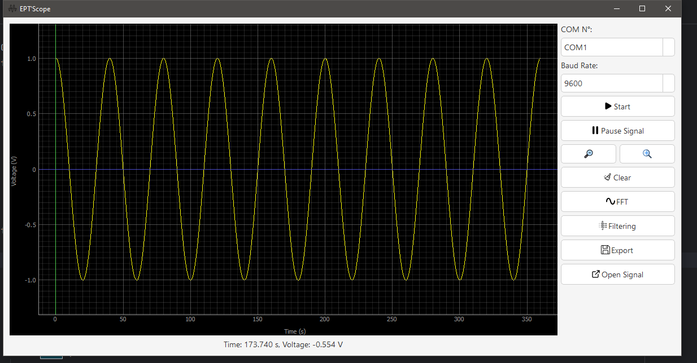

# STM32 Oscilloscope App 🔦🔬

This is an oscilloscope application built with STM32 Nucleo-H533RE boards and Python (PyQt5). The app allows users to capture, visualize, and analyze waveform data in real-time, with adjustable parameters such as time base, voltage scale, and trigger settings. The waveform data can be logged and exported to text files for further analysis.

## Features ✨

- Real-time waveform display 📊
- Adjustable settings (time/div, volts/div, trigger) ⚙️
- Data logging to text files 💾
- Multi-channel support (if using both Nucleo boards) 🔐
- Zoom functionality for waveform analysis 🔍
- Simple and intuitive GUI built with PyQt5 🖱️

## Screenshot 📸



## Requirements ⚡

- Python 3.x 🐍
- PyQt5 📦
- STM32 Nucleo-H533RE boards 🫷
- STM32CubeIDE for programming STM32 boards 💻
- USB cable for connecting the Nucleo boards to your PC 🔐

## Installation ⚙️

1. Clone this repository:
   
2. Install the required Python libraries:
  
3. Program the STM32 Nucleo boards using STM32CubeIDE or a similar tool with the necessary code for capturing and sending waveform data.

## Usage 🚀

1. Connect the Nucleo boards to your PC via USB.
2. Launch the app:
   ```bash
   python oscilloscope.py
   ```
3. Use the GUI to adjust oscilloscope settings and view the captured waveform.
4. Save waveform data to a text file for further analysis.


## Acknowledgements 🙏

- PyQt5 for the graphical user interface.
- STM32 Nucleo-H533RE boards for hardware interfacing.

